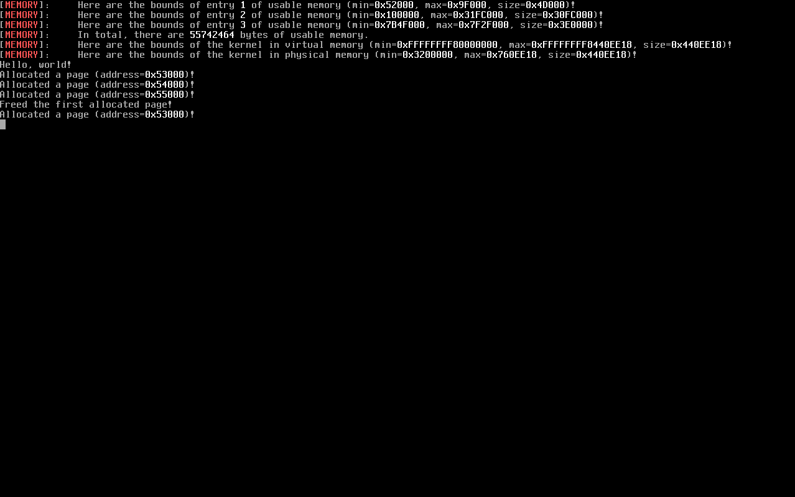

# M/UX
## About
M/UX is a work-in-progress UNIX-like kernel for amd64 processors, designed to run with the limine bootloader, a bootloader with a superior boot protocol.
## Roadmap
- [ ] GDT (Global Descriptor Table)
- [X] IDT (Interrupt Descriptor Table)
- [ ] Exceptions
- [X] Serial
- [X] ACPI
- [ ] Timer interrupt
- [X] Physical memory management
- [ ] Virtual memory management
- [ ] Multitasking
- [ ] Virtual filesystem
- [ ] Print `Hello, world!` in userland
## Architectures
- [X] amd64-pc
## Building
To build M/UX, you'll need GNU, or BSD make. You'll also need a `x86_64-elf` toolchain. After obtaining a program that can execute `Makefile`s and obtaining a `x86_64-elf` toolchain, build the kernel by executing the `Makefile`:
```
make 3RDPARTY=false
```
Oh yes, and make sure that you have `limine` built as well! To do this, simply run:
```
make limine
```
This should fix the error you get from limine not being present. Then, try again, and the compilation should work. To get the kernel running, simply execute:
```
make run
```
Make sure you have QEMU installed in order to get the kernel running.
If your operating system supports KVM, you can go ahead and run with KVM, which should make QEMU's emulation even faster:
```
make run-kvm
```
# Debugging
You can also debug the kernel in VSCode by running `make debug` or `make debug-kvm`, switching to the `Run and Debug` section, and then running `kernel`:


If you just want to debug with GDB on the terminal without any GUI, run `make debug` or `make debug-kvm`, and run GDB. After starting GDB, run the following commands in GDB:
```
file kernel.elf
target remote localhost:1234
```
# Screenshot(s)
Here's what M/UX currently looks like when you run it:

